�# BNWEMS — ERD (Entity Relationship Diagram)

> **Binh Nguyen Wedding & Event Management System** — CSDL nội bộ quản lý cưới hỏi/sự kiện & cho thuê thiết bị.
> Bản **đồ án tốt nghiệp**: **28 bảng** cốt lõi. Phần **lương/wage** đã loại trừ. Nguồn: `bnwems-web-frontend/src/types/*.ts` (model Prisma backend thật).

**Bộ file trong thư mục `database/`**
| File | Dùng để |
|---|---|
| [`migrations/001_core.sql`](migrations/001_core.sql) | **Migration LÕI** — 24 bảng (22 enum). Chạy trước. |
| [`migrations/002_warehouse_logistics.sql`](migrations/002_warehouse_logistics.sql) | **Migration KHO VẬN** — 4 bảng (3 enum). Chạy sau `001`. |
| [`schema.core.dbml`](schema.core.dbml) | DBML **version 1 / core** (24 bảng) — mở trên dbdiagram.io khi build từ đầu. |
| [`schema.full.dbml`](schema.full.dbml) | DBML **version 2 / full** (28 bảng = lõi + kho vận). |
| [`TABLES.md`](TABLES.md) | **Giải thích chi tiết từng bảng** — dùng cho báo cáo. |
| `ERD.md` | Tài liệu này — sơ đồ quan hệ + tóm tắt + ghi chú thiết kế. |

**Chạy tạo DB** (đã kiểm thử MySQL 8.0 — `001` độc lập = 24 bảng, nối `002` = 28 bảng, FK 002→001 pass):
```bash
psql -d bnwems -f migrations/001_core.sql
psql -d bnwems -f migrations/002_warehouse_logistics.sql   # thêm module kho vận khi cần
```
**Xem sơ đồ trực quan:** https://dbdiagram.io → New Diagram → dán `schema.core.dbml` (lõi) hoặc `schema.full.dbml` (đầy đủ). Hoặc xem Mermaid ERD bên dưới.

> **Tách module KHO VẬN:** 4 bảng `inventory`, `inventory_movements`, `collected_equipment_reports`, `collected_equipment_report_items` được tách riêng ra migration `002` để phần lõi gọn khi phát triển từ đầu. **Mọi FK đi từ kho vận → lõi** (một chiều), nên `001` chạy độc lập được và thêm `002` sau mà không phải sửa lõi.

Tổng quan: **28 bảng · 25 enum · 53 khóa ngoại** (lõi 24 bảng/22 enum/42 FK + kho vận 4 bảng/3 enum/11 FK), chia 7 nhóm domain.

---

## 1. Sơ đồ quan hệ (Mermaid ERD)

```mermaid
erDiagram
  users {
    varchar(36) user_id PK
    varchar username UK
    varchar full_name
    enum role "ADMIN|MANAGER|LEADER|TECHNICAL"
    enum status
  }
  customers {
    varchar(36) customer_id PK
    varchar customer_code UK
    varchar customer_name
    varchar phone
    enum status
  }
  suppliers {
    varchar(36) supplier_id PK
    varchar supplier_code UK
    varchar supplier_name
    varchar service_type
    enum status
  }
  business_policies {
    varchar(36) policy_id PK
    varchar policy_code UK
    enum policy_type
    numeric policy_value
    bool is_active
  }
  item_categories {
    varchar(36) category_id PK
    varchar category_name
  }
  item_types {
    varchar(36) type_id PK
    varchar(36) category_id FK
    varchar type_name
    bool is_active
  }
  items {
    varchar(36) item_id PK
    varchar item_code UK
    varchar(36) type_id FK
    numeric rental_price
    numeric purchase_price
    enum status
  }
  inventory {
    varchar(36) inventory_id PK
    varchar(36) item_id FK "1-1"
    int quantity_total
    int quantity_available
  }
  evidences {
    varchar(36) evidence_id PK
    text file_url
    varchar(36) uploaded_by FK
  }
  quotations {
    varchar(36) quotation_id PK
    varchar quotation_code UK
    varchar(36) customer_id FK
    varchar version
    numeric total_amount
    enum status
    varchar(36) created_by FK
  }
  quotation_items {
    varchar(36) quotation_item_id PK
    varchar(36) quotation_id FK
    varchar(36) item_id FK
    int quantity
    numeric price
    numeric line_total "generated"
  }
  orders {
    varchar(36) order_id PK
    varchar order_code UK
    varchar(36) customer_id FK
    varchar(36) quotation_id FK
    varchar(36) policy_id FK
    timestamp event_date
    numeric total_amount
    enum payment_status
    enum order_status
    varchar(36) created_by FK
  }
  order_items {
    varchar(36) order_item_id PK
    varchar(36) order_id FK
    varchar(36) item_id FK
    int quantity
    numeric unit_price
    numeric subtotal "generated"
    enum source
  }
  work_tasks {
    varchar(36) task_id PK
    varchar task_code UK
    varchar task_name
    bool is_active
  }
  schedule_plans {
    varchar(36) plan_id PK
    varchar plan_code UK
    varchar(36) order_id FK
    varchar(36) task_id FK
    timestamp start_time
    enum status
    varchar(36) evidence_id FK
    varchar(36) created_by FK
  }
  schedule_plan_assignees {
    varchar(36) assignee_id PK
    varchar(36) plan_id FK
    varchar(36) user_id FK
    enum role "LEAD|TECHNICAL"
  }
  attendances {
    varchar(36) attendance_id PK
    varchar(36) assignee_id FK "1-1"
    timestamp check_in_at
    varchar(36) check_in_evidence_id FK
    timestamp check_out_at
  }
  survey_reports {
    varchar(36) survey_id PK
    varchar report_code UK
    varchar(36) order_id FK
    varchar(36) plan_id FK
    enum status
    varchar(36) reported_by FK
    varchar(36) confirmed_by FK
  }
  change_requests {
    varchar(36) change_request_id PK
    varchar(36) order_id FK
    enum type
    enum status
  }
  change_request_items {
    varchar(36) change_request_item_id PK
    varchar(36) change_request_id FK
    varchar(36) catalog_item_id FK
    int quantity
    enum action
  }
  supplier_transactions {
    varchar(36) transaction_id PK
    varchar transaction_code UK
    varchar(36) supplier_id FK
    varchar(36) order_id FK
    enum transaction_type
    enum payment_status
    enum status
  }
  supplier_transaction_items {
    varchar(36) st_item_id PK
    varchar(36) transaction_id FK
    varchar(36) item_id FK
    int quantity
    numeric unit_cost
    numeric subtotal "generated"
  }
  collected_equipment_reports {
    varchar(36) report_id PK
    varchar(36) order_id FK
    enum report_type
    varchar(36) transaction_id FK
    enum status
    varchar(36) reported_by FK
    varchar(36) confirmed_by FK
  }
  collected_equipment_report_items {
    varchar(36) cer_item_id PK
    varchar(36) report_id FK
    varchar(36) item_id FK
    int good_quantity
    int damaged_quantity
    int lost_quantity
  }
  inventory_movements {
    varchar(36) movement_id PK
    varchar(36) item_id FK
    varchar(36) order_id FK
    varchar(36) report_id FK
    enum movement_type
    int quantity
    varchar(36) performed_by FK
  }
  deposits {
    varchar(36) deposit_id PK
    varchar deposit_code UK
    varchar(36) order_id FK
    numeric amount
    enum status
    varchar(36) requested_by FK
    varchar(36) approved_by FK
    varchar(36) evidence_id FK
  }
  settlements {
    varchar(36) settlement_id PK
    varchar(36) order_id FK
    numeric final_amount
    enum status
    varchar(36) requested_by FK
    varchar(36) confirmed_by FK
    varchar(36) evidence_id FK
  }
  notifications {
    varchar(36) notification_id PK
    varchar(36) user_id FK
    varchar title
    enum notification_type
    bool is_read
  }

  %% ===== RELATIONSHIPS =====
  users ||--o{ evidences : "tải lên"
  users ||--o{ orders : "tạo"
  users ||--o{ quotations : "tạo"
  users ||--o{ schedule_plans : "lập"
  users ||--o{ schedule_plan_assignees : "tham gia"
  users ||--o{ notifications : "nhận"

  item_categories ||--o{ item_types : "gồm"
  item_types ||--o{ items : "gồm"
  items ||--|| inventory : "tồn kho 1-1"
  items ||--o{ inventory_movements : "biến động"
  items ||--o{ quotation_items : "trong báo giá"
  items ||--o{ order_items : "được đặt"
  items ||--o{ change_request_items : "thay đổi"
  items ||--o{ collected_equipment_report_items : "kiểm đếm"
  items |o--o{ supplier_transaction_items : "ánh xạ"

  customers ||--o{ quotations : "có"
  customers ||--o{ orders : "có"
  quotations ||--o{ quotation_items : "gồm"
  quotations |o--o{ orders : "tham chiếu"
  business_policies |o--o{ orders : "áp dụng"

  orders ||--o{ order_items : "gồm"
  orders ||--o{ schedule_plans : "điều phối"
  orders ||--o{ survey_reports : "khảo sát"
  orders ||--o{ change_requests : "phát sinh"
  orders ||--o{ supplier_transactions : "thuê ngoài"
  orders ||--o{ collected_equipment_reports : "thu hồi"
  orders ||--o{ deposits : "đặt cọc"
  orders ||--o{ settlements : "quyết toán"
  orders ||--o{ inventory_movements : "xuất/nhập kho"

  work_tasks ||--o{ schedule_plans : "loại việc"
  schedule_plans ||--o{ schedule_plan_assignees : "gồm người"
  schedule_plan_assignees ||--|| attendances : "chấm công"
  schedule_plans |o--o{ survey_reports : "gắn"

  change_requests ||--o{ change_request_items : "gồm"

  suppliers ||--o{ supplier_transactions : "giao dịch"
  supplier_transactions ||--o{ supplier_transaction_items : "gồm"
  supplier_transactions |o--o{ collected_equipment_reports : "trả đồ NCC"

  collected_equipment_reports ||--o{ collected_equipment_report_items : "gồm"
  collected_equipment_reports |o--o{ inventory_movements : "nhập lại kho"

  evidences |o--o{ schedule_plans : "minh chứng"
  evidences |o--o{ attendances : "chứng từ check-in"
  evidences |o--o{ survey_reports : "minh chứng"
  evidences |o--o{ deposits : "chứng từ"
  evidences |o--o{ settlements : "chứng từ"
```



---

## 2. 27 bảng theo 7 nhóm domain

| Nhóm | Migration | Bảng |
|---|---|---|
| 🔵 **Identity & Master data** (4) | 001 | `users`, `customers`, `suppliers`, `business_policies` |
| 🟢 **Catalog** (3) | 001 | `item_categories` → `item_types` → `items` |
| 🟣 **Sales & Orders** (4) | 001 | `quotations`, `quotation_items`, `orders`, `order_items` |
| 🟠 **Operations** (7) | 001 | `work_tasks`, `schedule_plans`, `schedule_plan_assignees`, `attendances`, `survey_reports`, `change_requests`, `change_request_items` |
| 🔴 **Suppliers/Procurement** (2) | 001 | `supplier_transactions`, `supplier_transaction_items` |
| 🔷 **Finance** (2) | 001 | `deposits`, `settlements` |
| ⚪ **Shared** (2) | 001 | `evidences`, `notifications` |
| 🟩 **KHO VẬN** (4) | **002** | `inventory`, `inventory_movements`, `collected_equipment_reports`, `collected_equipment_report_items` |

> Trong sơ đồ Mermaid ở trên, 4 bảng nhóm **🟩 KHO VẬN** là phần tách ra migration `002`; 23 bảng còn lại thuộc migration `001` (lõi).
> Chi tiết mục đích + từng cột của mỗi bảng: xem [`TABLES.md`](TABLES.md).

---

## 3. Vòng đời Order ánh xạ xuống bảng

| Giai đoạn nghiệp vụ | Bảng liên quan | Trạng thái |
|---|---|---|
| Tạo đơn | `orders`, `order_items` | `order_status=NEW`, `payment_status=UNPAID` |
| Khảo sát | `survey_reports` (+ `schedule_plans`, `evidences`) | `survey.status: DRAFT→SUBMITTED→CONFIRMED` |
| Báo giá | `quotations`, `quotation_items` | `quotation.status: DRAFT→APPROVED` |
| Cọc + khóa kho | `deposits`, `inventory` (reserved) | `deposit.status=SUCCESS` → `order=CONFIRMED`, `payment=DEPOSITED` |
| Điều phối | `schedule_plans`, `schedule_plan_assignees`, `work_tasks`, `attendances` | `schedule.status: PENDING→…→COMPLETED` |
| Thuê ngoài | `supplier_transactions` (+ items) | `RENTAL/PURCHASE`, `PENDING→…→COMPLETED` |
| Xuất kho / thi công | `inventory_movements` (OUTBOUND), `order_items.prepared_qty` | `order=IN_PROGRESS` |
| Thay đổi thiết bị | `change_requests`, `change_request_items` | `pending→approved/rejected` |
| Nghiệm thu | `schedule_plans` (handover), `evidences` | — |
| Thu hồi + hỏng/mất | `collected_equipment_reports` (+items), `inventory_movements` (INBOUND) | `SUBMITTED→CONFIRMED` |
| Quyết toán | `settlements` | `DRAFT→AGREED→REQUESTED→PAID→CONFIRMED` → `payment=PAID` |
| Đóng đơn | `orders` | `order_status=COMPLETED` |

---

## 4. Ghi chú & quyết định thiết kế

- **Khóa chính varchar(36)** (`(UUID())`); tên bảng/cột **snake_case** (chuẩn MySQL). Tiền: `numeric(14,2)` VNĐ. Thời gian: `timestamp`, `created_at/updated_at` mặc định `CURRENT_TIMESTAMP` + **trigger tự cập nhật `updated_at`**.
- **Enum native MySQL** (case-sensitive). Lưu ý nhóm `change_request_*` dùng chữ **thường** (`add/remove/replace`, `pending/approved/rejected`) đúng như code khai báo.
- **Generated columns** (STORED): `quotation_items.line_total`, `order_items.subtotal`, `supplier_transaction_items.subtotal`.
- **Role là enum cố định trên `users`** — không tạo bảng `roles` (code nêu rõ "không còn endpoint GET /roles").
- **Không hard-delete**: đa số entity dùng `status`/`is_active`; xóa chỉ ở draft → enforce ở tầng ứng dụng.
- **Polymorphic không FK**: `notifications.(ref_type, ref_id)`.
- **Mô hình "hiện trường ghi → Manager xác nhận"**: các cặp `reported_by/confirmed_by` (survey, collected report), `requested_by/approved_by/confirmed_by` (deposit, settlement).
- **Phân công nhiều–nhiều**: một đầu mục công việc (`schedule_plans`) có nhiều người qua bảng nối `schedule_plan_assignees(plan_id, user_id, role)`. `role` = `LEAD` (giám sát) / `TECHNICAL`, **gán theo từng plan** (khớp app mobile: một người có thể là LEAD ở plan này, TECHNICAL ở plan khác). Ràng buộc `unique(plan_id, user_id)` + partial-unique **tối đa 1 LEAD/plan**. `attendances` chấm công **1-1 theo từng dòng phân công** (`assignee_id`).

### Đã tinh gọn từ bản đầy đủ (34 → 27 bảng)
Bỏ 7 bảng để phù hợp phạm vi đồ án (đều có thể thêm lại nếu cần):
| Bỏ | Lý do |
|---|---|
| `equipment_type_configs` (tầng 4 catalog) | Backend chưa có model/endpoint — rút về catalog 3 tầng. |
| `item_type_specs` (BOM linh kiện) | Tính năng phụ, ngoài luồng đặt hàng chính. |
| `business_service_packages`, `supplier_service_packages` | Mock UI, không nối vào luồng order (order tham chiếu `items`). |
| `device_tokens` | Chi tiết hạ tầng push notification. |
| `order_warnings` | Cảnh báo phụ của dashboard vận hành. |
| `notification_recipients` | Gộp vào `notifications` (mỗi dòng = 1 người nhận). |

### Loại trừ theo yêu cầu
Toàn bộ phần **lương/wage** (bảng WageRule/payroll). Giữ `attendances` (chấm công vận hành, hiển thị ở app staff) vì không phải bảng tính lương; enum `policy_type` đã bỏ giá trị `WAGE`.

